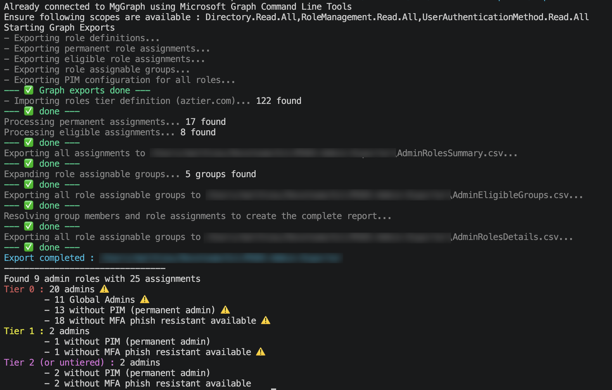

# M365-Admin-Exporter
## Description
This powershell script is designed to export all admin roles assignments from Entra, including permanent membership, eligible membership, and members from groups assigned to roles.\
Roles are classified using tier model from [emiliensocchi](https://github.com/emiliensocchi/azure-tiering/tree/main).\
The script also export authentication methods registred for each admin to evaluate if MFA phishing resistant is available (may not be enforced !)

## Prerequisites
- Powershell 7+ recommended
- Microsoft.Graph.Authentication Module
- Graph Scopes : Directory.Read.All, RoleManagement.Read.All, UserAuthenticationMethod.Read.All
- Entra tier definition from [aztier.com](https://aztier.com/#entra) along with the script (same folder) : [JSON Source](https://github.com/emiliensocchi/azure-tiering/blob/main/Entra%20roles/tiered-entra-roles.json)
- Launch the script !
```
.\Export-EntraRoles.ps1
```

## Output
- Quick recap in console (number of admin per tier, PIM not enabled, MFA phish resistant not available)
- **AdminRolesSummary.csv** : Direct members of each Entra role
- **AdminRolesDetails.csv** : All principals directly or not assigned to Entra role
- **AdminEligibleGroups.csv** : All Entra groups eligible to role assignment

